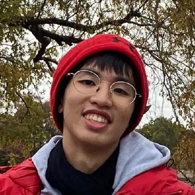
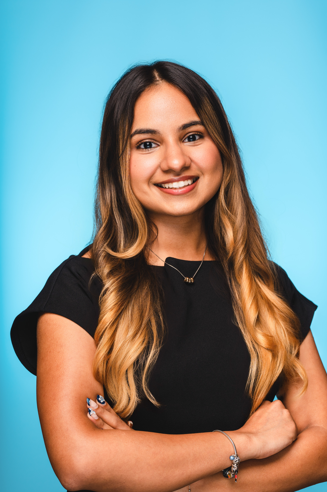
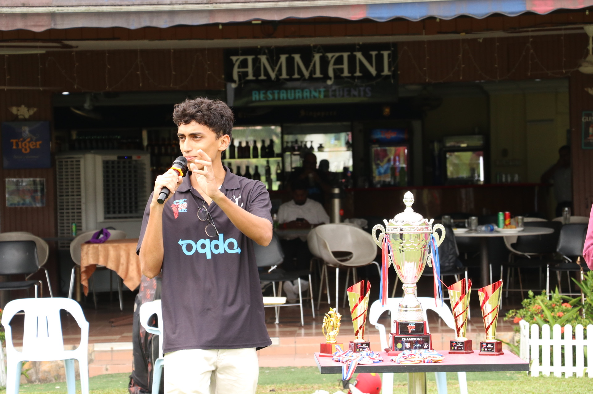

We are a team based in the [School of Computing, National University of Singapore](https://www.comp.nus.edu.sg).

You can reach us at the email `seer[at]comp.nus.edu.sg`

## Project team

### Andrew Soon

[[homepage](andrewsoon.com)]
[[github](https://github.com/andrewsoonqn)]
[[portfolio](team/andrewsoon.md)]

### Sayyid Mehdi

[[homepage](http://www.comp.nus.edu.sg/~damithch)]
[[github](https://github.com/lamemario)]

* Role: Project Developer

### Aishwarya Goyal

[[github](http://github.com/aishgogoyal)]
[[portfolio](team/aishgogoyal.md)]

* Role: Team Lead
* Responsibilities: UI

### Jean Doe

[[github](http://github.com/johndoe)]
[[portfolio](team/johndoe.md)]

* Role: Developer
* Responsibilities: Dev Ops + Threading

### Atharva

[[github](http://github.com/athrv2)]
[[portfolio](team/atharva.md)]

* Role: Developer
* Responsibilities: UI
